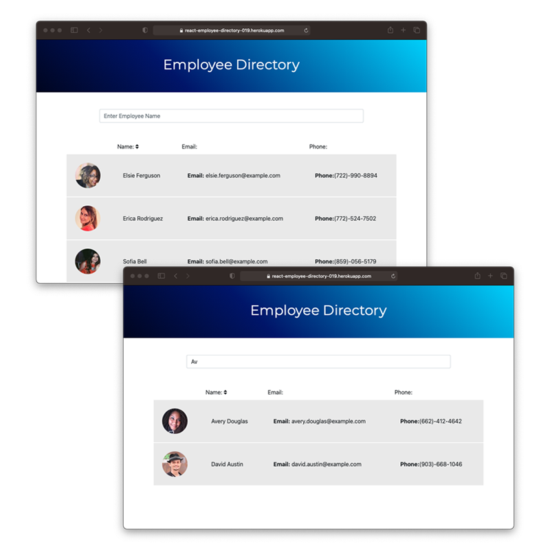

# 019-Employee-Directory
App built with React.js. Pulls user data from an API, this app was primarily an exercise in working with React States.

[Live Deploy on Heroku](https://react-employee-directory-019.herokuapp.com/)

# :zap: Description

Small web app built with React.js, incorporating the use of components and states. The app pulls a random list of users from the [Random User API](https://randomuser.me/). Once the data is loaded into the initial state, we adjust the state of the app based on sorting name alphabetically, or by the input change in the search bar.

# :zap: Functionality

Functionality for this app is very straight forward. Once the employee results load in, clicking on the "Name" header will sort the table alphabeticaly (A-Z or Z-A) by name. Using the search bar, the list will begin to filter as you type.

# :zap: License

This project is covered under the license: MIT

